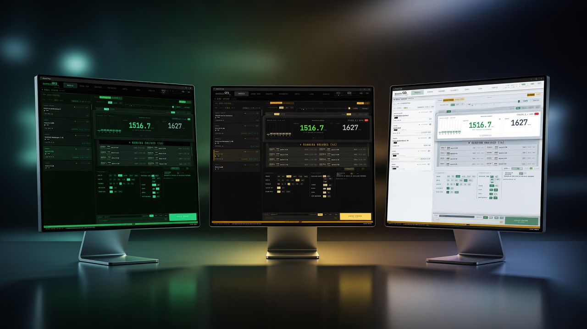
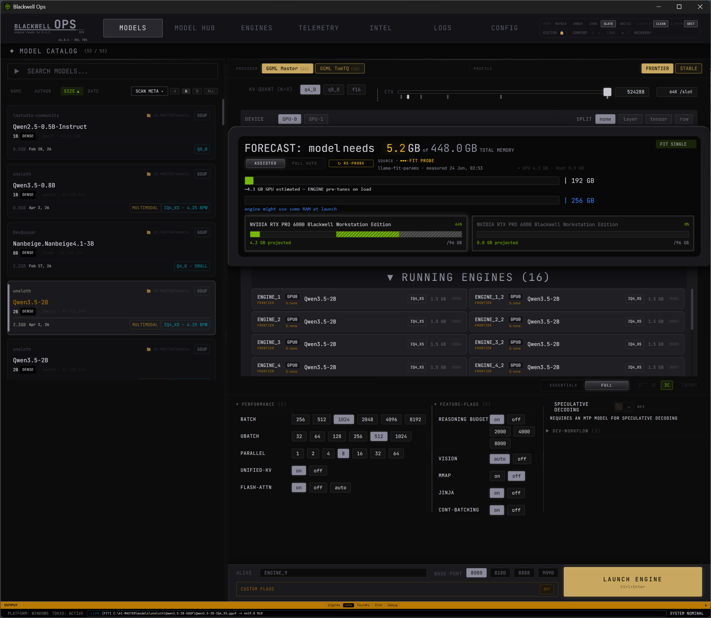
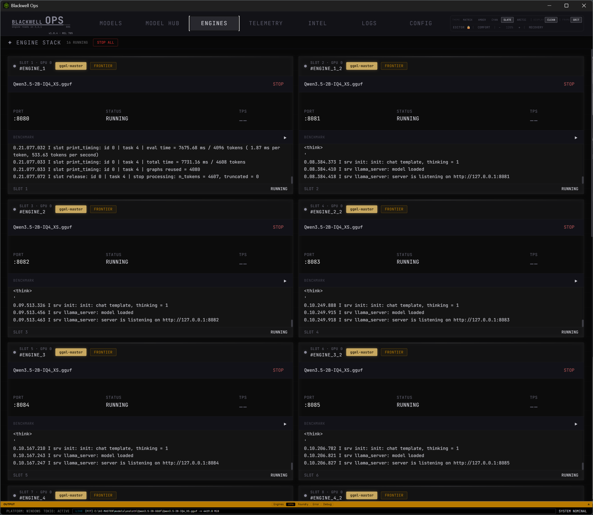
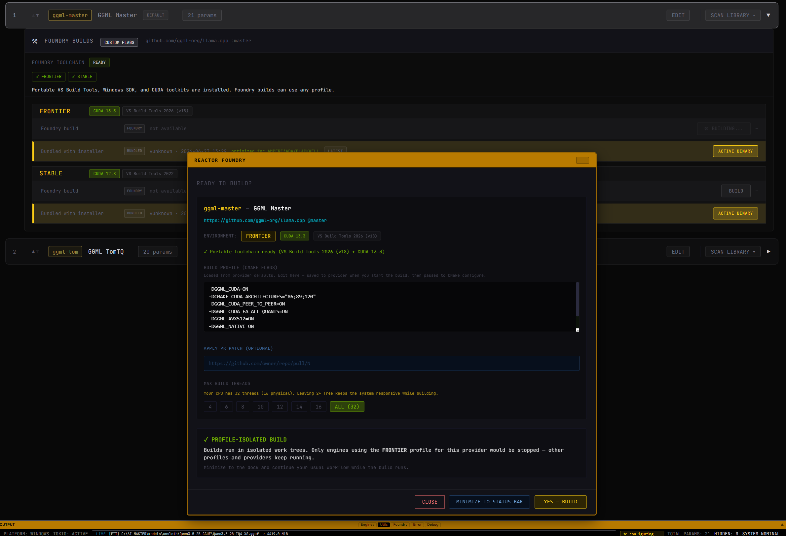

# Blackwell Ops

**Windows-native command center for local LLM inference — open source, portable, and built to prove a point.**

[→ Quick Start](#quick-start)

> *This project is my testament to open source and a **local inference first** mission.*

You do **not** need Linux to run serious LLM workloads on your own hardware.
Blackwell Ops exists to challenge it — directly, on Windows, with top performance and minimal memory footprint.
---

## What it is

Blackwell Ops is a private native Windows app for local LLM infrastructure that orchestrates `llama-server` engines (more will follow), model libraries, VRAM fit scanning, foundry CMake builds, and live telemetry — without Docker, without WSL gymnastics, without handing your stack to the cloud. Fully portable, Open Source, no telemetry.

Drop the installer or portable folder anywhere. The app recreates its ecosystem around itself: configs, runtime engines, foundry artifacts, and user preferences — all relative to the install directory.

**At v1.0.x** the focus is **GGML / llama.cpp** (official master + IK fork bundled). Any llama-compatible fork can be easily wired in; fusion performance metrics may not map 1:1 to every backend yet. The architecture is **semi–backend-agnostic** by design — support grows over time.
---

## By the numbers

| | |
|---|---|
| **Core binary** | ~14 MB Rust executable |
| **Typical RAM (app shell)** | ~40 MB running — about half what Windows Notepad needs |
| **Engine slots (factory)** | Up to **64** concurrent instances (GGML master) |
| **Stress-tested** | **64** engine instances orchestrated with **~400 MB** total app RAM overhead |
| **Build investment** | ~**2,500+ hours** across ~5 months |
| **GPU targets** | **BLACKWELL** (heavily optimized), also **AMPERE · ADA** |

*Engine VRAM is separate — these figures are the ops layer, not model weights.*

---

## Why Windows — on purpose

- **Native Rust, Win32/Tauri shell** — no Electron bloat, no Linux subsystem tax  
- **Foundry** — build `llama-server` from source on your machine (VS2022 / VS2026 + CUDA 12.8–13.3)  
- **Portable path model** — clone/move the folder, it still works, even from a flash drive.
- **Full config freedom** — factory templates merge with your overrides; nothing hidden behind a SaaS panel  
- **Low idle cost** — run many engine *slots* without many heavy processes until you launch  

---

## Bundled engine profiles (v1.0)

Pre-built binaries ship for multiple toolchain generations — pick the profile that matches your GPU and driver stack:

| Profile | CUDA | Toolchain |
|---------|------|-----------|
| **FRONTIER** | 13.3 | VS Build Tools 2026 | - The one Cuda to rule them all
| **STABLE** | 12.8 | VS Build Tools 2022 | - compatible path.

- Includes **GGML llama (master)** and **Tom-llama** runtimes.  
- Users can **Foundry-build** their own engines anytime (5minutes 1 click), or download asset packages later — the app does not lock you to shipped binaries.

---

## Features
- **rapid onboarding** — two-click path from zero to first inference (>1 minute of your time)
- **Model library** — GGUF catalog, metadata scan, VRAM fit scan across your library, comprehensive benchmarks
- **Engine stack** — monitor, bench or stop many `engine` instances from one surface  
- **Provider templates** — Full params editor, params catalog - 1click add any of the 250+ parameters
- **Foundry** — repo update, configure, compile, and publish binaries from the UI, support PR integrations and custom cmake flags 
- **Fusion telemetry** — multilayered semi REAL-TIME metrics, generation, prefill, prefill progress etc  
- **Console** — unified pipeline log (General, Engines, Foundry, Errors...dock or detach window
- **Engine Logs** - up to 64 simultanous rich html log streams, with full text search and highlight
- **Portable install** — relative paths, `runtime/` beside the exe, no registry religion 
- **HW telemetry** - usefull statistics, vital signs for all your RIG HW
- **Intel widgets** - llama news, PR, releases - comparison to what config you actually use atm.

- **NO APP TELEMETRY, no calling home ever!!**

---

## Screenshots & demo

| Main dashboard | Engine stack | Foundry build |
|:---:|:---:|:---:|
|  |  |  |

---

## Quick start

1. Download the latest **`Blackwell Ops_*_x64-setup.exe`** from [Releases](https://github.com/Seen-Tomorrow/blackwell-ops/releases).  
2. Install (or extract portable layout if you ship a zip).  
3. Point **Setup Guide → Step 1** at your GGUF model folder (or LM Studio path).  
4. Pick a **provider profile** (FRONTIER or STABLE).  
5. Launch an engine.  

First-run onboarding walks the rest.

[ONBOARDING VIDEO](docs/videos/blackwell_ops_onboarding.mp4)

### Requirements

- **Windows 10/11 x64**  
- **NVIDIA GPU** recommended (CUDA builds bundled), AMD, Intel will follow
- **GGUF models** — not included; you bring your own weights  
**Optional and trongly recommended** **BUILD TOOLS package** -for Foundry cmake builds
[BUILD TOOLS package](https://github.com/Seen-Tomorrow/blackwell-ops/releases/tag/toolchain).

---

## A personal note

I did not type this codebase by hand line-by-line. I **vibe-coded** it on **local models** — mostly **Qwen3.5 236B** + **Qwen3.6 27B** — with hardening passes on **Composer 2.5**, on hand build custom workstation (**2× RTX PRO 6000 · 256 GB VRAM**).

What I *did* bring is **30+ years** of love for PC hardware and Windows — how machines should feel, how software should respect RAM, how inference should stay on *your* desk.

Roughly **2,500 hours** went into this across ~five months. Time not spent with my family and my **five-year-old daughter**, who I love more than anything. This repo is what that time became.

If Blackwell Ops helps one person run serious local inference on Windows without apologizing for their OS choice, it was worth it.

---

## Roadmap (honest)

- [ ] In-app binary updates (GitHub release assets)  
- [ ] Broader backend adapters beyond GGML llama and TOM llama
- [ ] Deeper fusion metrics for third-party forks
- [ ] and one surprise very soon ;-)

---

## Links

- **Releases:** https://github.com/Seen-Tomorrow/blackwell-ops/releases  
- **Issues:** https://github.com/Seen-Tomorrow/blackwell-ops/issues  

---

  <strong>Local inference first. Windows is not the compromise.</strong> 
  Built with open source engines, open source tools, and closed-door family time I'll try to win back.

